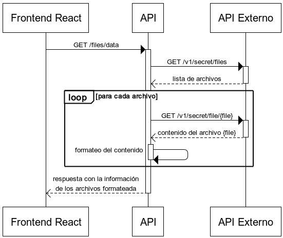
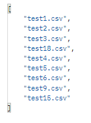
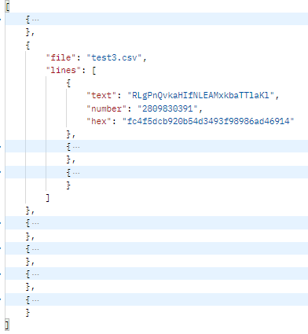
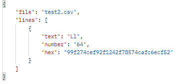

# BACK END

  Esta API REST se desarrollo utilizando Node, Express y Axios, los servicios y funciones se encuentran testeados con Mocha y Chai su estructura se basa en la separacion de responsabilidades y consume la api externa https://echo-serv.tbxnet.com/explorer/ para la obtencion de datos.


<details>
<summary>Estructura de Carpetas</summary>

```bash 
api/
│
├── src/
│ ├── controllers/
│ | ├── index.js
│ | └── dots/
| |   └── index.js
| |
│ ├── routes/
│ │ └── index.js
│ │
│ ├── helper/
| | ├── index.js
| | ├── filterRequest.js
| | ├── httpsClien.js
| | └── ...
| |
│ ├── constants/
| | └── index.js
| |
│ └── test/
│   ├── controllers/...
│   ├── helpers/...
│   └── routes/...
|
├── index.js
├── package.json
├── README.md
└── ...
```

</details>

<br>

#### Diagrama


<br>

#### Cómo Probar

* Accede a la carpeta de la aplicacion ejecutando el siguiente comando: ```cd api```.
* En la terminal del proyecto, ejecuta el siguiente comando para instalar las dependencias: ```npm install```.
* Una vez finalizada la instalación, inicia el proyecto con el siguiente comando: ```npm run dev```.
* Si deseas ejecutar las pruebas, utiliza: ```npm run test```
<br>

### Endpoints

### Listado de archivos disponiles

<br>

```bash 
  http://localhost:4000/files/list
```
<br>

<table>
  <caption>
    <h3>Contrato</h3>
    <hr/>
  </caption>
  <tr>
    <th>Aspecto</th>
    <th>Descripción</th>
  </tr>  
  <tr>
    <td>Objectivo</td>
    <td>Comunicación Frontend-Backend para el Endpoint <b>/files/list</b></td>
  </tr>
  <tr>
    <td>Fecha de Creación</td>
    <td>14/12/2023</td>
  </tr>
  <tr>
    <td>Endpoint</td>
    <td>/files/list</td>
  </tr>
  <tr>
    <td>Parametros</td>
    <td>-</td>
  </tr>
  <tr>
    <td>Method</td>
    <td>GET</td>
  </tr>
  <tr>
    <td>Response</td>
    <td>
      <table>
        <tr>
          <td>Status</td>
          <td>200</td>
        </tr>
        <tr>
          <td>Tipo de datos</td>
          <td>Array de string</td>
        </tr>
        <tr>
          <td>Data</td>
          <td>
            
          </td>
        </tr>
      </table>
    </td>
  </tr>
</table>
  
<br>

  Esta ruta consume el endpoint externo ```https://echo-serv.tbxnet.com/v1/secret/files``` y response con un listado de nombres de archivos disponibles  

<br>

### Lista de archivos

<br>

```bash 
  http://localhost:4000/files/data
```
<br>

<table>
  <caption>
    <h3>Contrato</h3>
    <hr/>
  </caption>
  <tr>
    <th>Aspecto</th>
    <th>Descripción</th>
  </tr>  
  <tr>
    <td>Objectivo</td>
    <td>Comunicación Frontend-Backend para el Endpoint <b>/files/data</b></td>
  </tr>
  <tr>
    <td>Fecha de Creación</td>
    <td>14/12/2023</td>
  </tr>
  <tr>
    <td>Endpoint</td>
    <td>/files/data</td>
  </tr>
  <tr>
    <td>Parametros</td>
    <td>-</td>
  </tr>
  <tr>
    <td>Method</td>
    <td>GET</td>
  </tr>
  <tr>
    <td>Response</td>
    <td>
      <table>
        <tr>
          <td>Status</td>
          <td>200</td>
        </tr>
        <tr>
          <td>Tipo de datos</td>
          <td>
            <table>
              <tr>
                <td>Array</td>
                <td>
                  <table>
                  <caption>
                    Objeto
                    <hr/>
                  </caption>
                    <tr>
                      <td>file</td>
                      <td>string</td>
                    </tr>
                    <tr>
                      <td>lines</td>
                      <td>
                        <table>
                          <caption>
                            Array
                            <hr/>
                          </caption>
                          <tr>
                            <td>object</td>
                            <td>
                              <table>
                                <tr>
                                  <td>text</td>
                                  <td>string</td>
                                </tr>
                                  <tr>
                                  <td>number</td>
                                  <td>number</td>
                                </tr>
                                <tr>
                                  <td>hex</td>
                                  <td>string</td>
                                </tr>
                              </table>
                            </td>
                          </tr>
                        </table>
                      </td>
                    </tr>
                  </table>
                </td>
              </tr>
            </table>
          </td>
        </tr>
        <tr>
          <td>Data</td>
          <td>
            
          </td>
        </tr>
      </table>
    </td>
  </tr>
</table>
  
<br>

  Esta ruta consume los endpoint ```https://echo-serv.tbxnet.com/v1/secret/files``` y ```https://echo-serv.tbxnet.com/v1/secret/file{name}``` para obtener la informacion de cada archivo, extraer aquellos cuyos datos esten incoompletos y retorna una lista con los archivos y su documentacion formateados.

<br>

###  Buscar un archivo por su nombre

<br>

```bash 
  http://localhost:4000/files/data?fileName={name}
```
<br>

<table>
  <caption>
    <h3>Contrato</h3>
    <hr/>
  </caption>
  <tr>
    <th>Aspecto</th>
    <th>Descripción</th>
  </tr>  
  <tr>
    <td>Objectivo</td>
    <td>Comunicación Frontend-Backend para el Endpoint <b>/files/data?FileName={name}</b></td>
  </tr>
  <tr>
    <td>Fecha de Creación</td>
    <td>14/12/2023</td>
  </tr>
  <tr>
    <td>Endpoint</td>
    <td>/files/data</td>
  </tr>
  <tr>
    <td>Parametros</td>
    <td>?fileName={name}</td>
  </tr>
  <tr>
    <td>Method</td>
    <td>GET</td>
  </tr>
  <tr>
    <td>Response</td>
    <td>
      <table>
        <tr>
          <td>Status</td>
          <td>200</td>
        </tr>
        <tr>
          <td>Tipo de datos</td>
          <td>
            <table>
              <tr>
                <td>Objecto</td>
                <td>
                  <table>
                    <tr>
                      <td>file</td>
                      <td>string</td>
                    </tr>
                    <tr>
                      <td>lines</td>
                      <td>
                        <table>
                          <tr>
                            <td>text</td>
                            <td>string</td>
                          </tr>
                          <tr>
                            <td>number</td>
                            <td>number</td>
                          </tr>
                          <tr>
                            <td>hex</td>
                            <td>string</td>
                          </tr>
                        </table>
                      </td>
                    </tr>
                  </table>
                </td>
              </tr>
            </table>
          </td>
        </tr>
        <tr>
          <td>Data</td>
          <td>
            
          </td>
        </tr>
      </table>
    </td>
  </tr>
</table>
  
<br>

  Esta ruta consume el endpoint ```https://echo-serv.tbxnet.com/v1/secret/file{name}``` para obtener la informacion del archivo, extraer aquellos cuyos datos esten incoompletos y retorna los datos formateados.

<br>