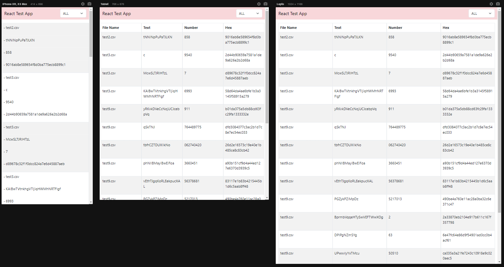

# FRONT END

  Esta aplicación se desarrollo utilizando React v18, Redux Toolkit y Javascript, los componentes y funciones se encuentran testeados con Jest y la aplicacion es responsiva, su estructura se organiza por funcionalidad.


<details>
<summary>Estructura de Carpetas</summary>

```bash 
client/
│
├── src/
│ ├── components/
│ │ ├── fileList/
│ │ │ ├── index.jsx
│ │ │ └── index.spec.jsx
│ │ ├── layout/...
│ │ ├── navbar/...
│ │ └── ui/
| |   ├── loader/
| |   | ├── index.jsx
| |   | └── index.spec.jsx
│ │   ├── select/...
│ │   ├── table/...
│ │   └── toast/...
| |
│ ├── constants/
│ │ ├── server.js
│ │ └── ...
│ │
│ ├── helper/
| | ├── httpsClient/
│ │ │ ├── index.js
│ │ │ └── index.spec.js
| | └── LogErros/...
| |
│ ├── mocks/
| | └── store/
│ |   └── index.js
| |
│ ├── services/
│ | └── index.js
| |
| ├── store/
│ | ├── index.js
│ | └── files/
│ │   ├── fileSlice.js
│ │   ├── thunk.js
│ │   └── index.js
| |
| ├── views/
│ | └── home/
│ │   └── index.jsx
| |
| └── wordings/
│   └── index.js
|
├── App.js
├── index.js
├── package.json
├── README.md
└── ...
```

</details>

<br>

#### Cómo Probar

* Accede a la carpeta de la aplicacion ejecutando el siguiente comando: ```cd client```.
* En la terminal del proyecto, ejecuta el siguiente comando para instalar las dependencias: ```npm install```.
* Una vez finalizada la instalación, inicia el proyecto con el siguiente comando: ```npm run start```.
* Si deseas ejecutar las pruebas, utiliza: ```npm run test```
<br>

### Pantalla y Opciones

<br>

La página de inicio cuenta con un listado de archivos organizados mediante una tabla, cuenta con un selector para filtrar que renderiza el listado de archivos existentes en la base de datos (algunos de estos pueden estar dañados o no contener informacion).

En caso de que la opcion selecionada contenga un error, se mostrara una alerta para informarle, si desea volver a todas las opciones solo seleccional 'ALL'

<br>



<br>
<br>
